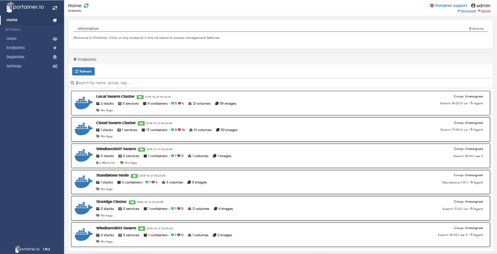

# Portainer

## Getting Started

Portainer is a simple management solution for Docker. Easily manage your Docker hosts and Docker Swarm clusters via Portainer web user interface.

### Prerequisites

```
Last version of docker in a swarm mode to using that stack.
```

### Running
```
docker stack deploy -c portainer.yml dc
```

### Checking
```
docker service ls
```
or
```
docker stack ls
```
_______
</img>
_______

### Authors

Rodrigo Carvalho </br>
DevOps Engineering </br>
Skype: rdgacarvalho